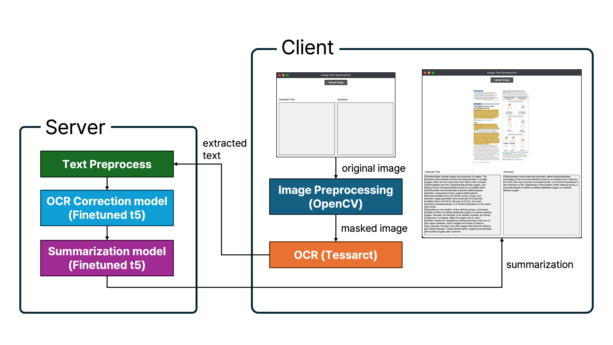

# BookToSumm
**Summarize your books in a *snap***


This python application automatically detects your highlighted texts and summarize. Workflow is shown above.




## Client

Uses OpenCV and Pytessarct to filter out and extracted highlighted text from image.

## Server

Server uses 'Post-OCR Correction Model' and 'Summarization Model' to effectively deal with text.
- Post-OCR Correction Model : [jwhong2006/t5-PostOCRAutoCorrecttion](https://huggingface.co/jwhong2006/t5-PostOCRAutoCorrecttion)
- Summarization Model : [jwhong2006/wikisum](https://huggingface.co/jwhong2006/wikisum)

Both models are fine-tuned versions of [t5-small](https://huggingface.co/google-t5/t5-small), each trained on [PleIAs/Post-OCR-Correction](https://huggingface.co/datasets/PleIAs/Post-OCR-Correction) and [d0rj/wikisum](https://huggingface.co/datasets/d0rj/wikisum).

## How to Use
1. Install [Tesseract](https://github.com/tesseract-ocr/tesseract)
2. Run following code
```
pip install pillow pytesseract requests opencv-python numpy flask transformers torch
python server.py
python app.py
```